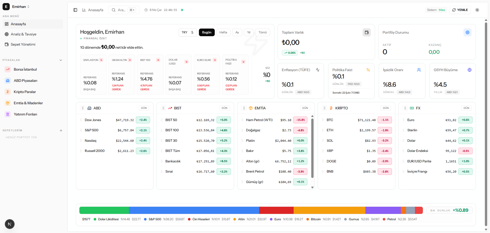
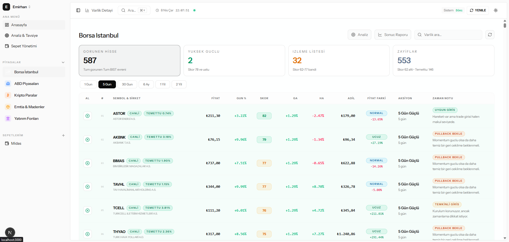
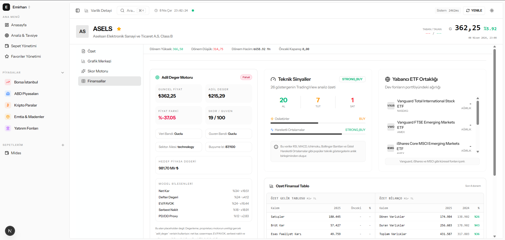

# mizan23

Local-first market intelligence and portfolio decision-support platform.

`mizan23` transforms raw market data into score, probability, action, and historical validation across BIST, US equities, crypto, commodities, funds, and FX.

## Language

- [Türkçe](#türkçe)
- [English](#english)



---

# Türkçe

## mizan23 Nedir?

`mizan23`, yalnızca fiyat gösteren bir piyasa ekranı değildir. Sistem;

- piyasa verisini toplar
- bu veriyi proprietary skor katmanlarına dönüştürür
- skoru olasılık ve aksiyona çevirir
- sonuçları tarihsel olarak doğrular
- portföy, favoriler ve profil bazlı kullanım akışı ile birleştirir

Kısacası amaç, parçalı araçlar yerine tek bir karar çalışma alanı sunmaktır.

## Neden Var?

Çoğu piyasa aracı şu alanlardan yalnızca birinde iyidir:

- fiyat takibi
- watchlist
- grafik
- tarama
- portföy takibi
- geçmiş performans doğrulaması

`mizan23`, bunları tek sistemde birleştirmek için geliştirildi.

Amaç “sihirli tahmin” üretmek değil; şeffaf, denetlenebilir ve tekrar edilebilir bir karar destek sistemi kurmaktır.

## Neden Farklı?

`mizan23` sıradan bir screener veya dashboard değildir. Ana farkları:

1. Zaman ufku odaklıdır.
   Sadece “güçlü/zayıf” demez; sinyalin hangi ufka ait olduğunu yorumlamaya çalışır.

2. Deterministik yapıdadır.
   Kara kutu AI yerine açık formüller, skor aileleri, güven cezaları ve sonuç takibi kullanır.

3. Sonuç takibi yapar.
   Sadece öneri üretmez; geçmişte bu önerilerin ne kadar doğru olduğunu da ölçer.

4. Piyasaya özel mantık kullanır.
   BIST, ABD, kripto, emtia ve fonları tek bir yüzeysel formüle zorlamaz.

5. Local-first yaklaşımı vardır.
   Sistem yerelde veya aynı ağ içinde çalışacak şekilde tasarlanmıştır.

## Kimler İçin?

Bu proje özellikle şunlar için uygundur:

- aktif yatırımcılar
- çoklu zaman ufkunda çalışan traderlar
- piyasaya yönelik ürün geliştiren yazılımcılar
- açık formülleri tercih eden quant-meraklı kullanıcılar
- aynı ağda ortak sistem kullanan küçük ekipler veya aileler

Şunlar için öncelikli olarak tasarlanmadı:

- yüksek frekanslı işlem
- broker otomasyonu
- kurumsal OMS/EMS sistemleri
- tam yönetilen SaaS dağıtımı

## Sistem Ne Üretir?

Sistem aşağıdaki türde çıktılar üretir:

- `BIST / 5 Gün / Skor 82 / Olasılık 0.86 / Aksiyon: Güçlü`
- `ABD / UNH / Adil Değer 360 / Fiyat Farkı +9% / İzle`
- `Kripto / SOL / BTC'ye göre alfa +1.2 / Referans bant üzerinde`
- `Portföy / THYAO / Hedef %17 / Hedefe kadar tut`
- `Sonuç raporu / 1 Gün modeli / yön isabeti %61 / alfa isabeti %57`

Yani sistem yalnızca veri göstermez; yorumlanabilir karar çıktısı üretir:

- skor
- olasılık
- beklenen getiri
- beklenen alfa
- risk tahmini
- aksiyon
- tarihsel doğrulama

## Bu Proje Ne Değildir?

- yatırım tavsiyesi değildir
- kesin tahmin sunduğunu iddia etmez
- “AI her şeyi bilir” yaklaşımıyla kurulmamıştır
- doğrudan emir iletim veya broker platformu değildir

## Ürün Görselleri

### Anasayfa


### BIST Piyasa Tabloları



### Varlık Detay Sayfası



## Desteklenen Piyasalar

| Piyasa | Kapsam | Ana Kullanım |
|---|---|---|
| BIST | Hisse, endeks, sektör, proprietary skorlar | Ana karar motoru |
| ABD | Hisse evreni, history ve analist hedefleri | Skor, aksiyon, adil değer kıyası |
| Kripto | Büyük ve orta ölçekli çiftler | Skor, BTC göreli alfa, referans bant |
| Emtia | Enerji, metal, kıymetli emtia | Trend ve taktik yorum |
| Fon | Yatırım ve emeklilik fonları | İstikrar ve dönemsel performans |
| Döviz / FX | Temel döviz sepeti | Takip ve çapraz piyasa bağlamı |

## Mimari

Sistem iki ana katmandan oluşur:

1. `Next.js` frontend
2. `FastAPI` Python engine

İstek akışı:

1. Kullanıcı arayüzde işlem yapar
2. İstek `/api/python/...` proxy katmanına gider
3. Proxy Python engine'e iletir
4. Engine veri toplar, skor üretir, cache ve snapshot kullanır
5. Sonuç frontend’e döner

Ana klasörler:

- [`app`](./app)
- [`components`](./components)
- [`services`](./services)
- [`store`](./store)
- [`lib`](./lib)
- [`engine-python/api`](./engine-python/api)
- [`engine-python/engine`](./engine-python/engine)
- [`engine-python/scoring`](./engine-python/scoring)
- [`engine-python/storage`](./engine-python/storage)
- [`docs`](./docs)

## Veri Kaynakları

| Kaynak | Kullanım | Piyasalar | Not |
|---|---|---|---|
| `borsapy` | BIST veri evreni, tarama, şirket/piyasa yapısı | BIST | BIST tarafındaki ana yapı taşlarından biri |
| `yfinance` | History, benchmark, analist hedefi, zenginleştirme | ABD, kripto, emtia | Cache ve snapshot ile korunur |
| Yerel snapshot'lar | Sonuç raporu ve hızlı tekrar kullanım | Tüm desteklenen piyasalar | Engine üretir |
| Yerel JSON / SQLite | Profil, favori, portföy, kalıcı durum | Uygulama geneli | Local-first yaklaşım |

Teşekkür:

Özellikle BIST tarafında bu platformun daha sistematik gelişmesini mümkün kılan `borsapy` ekosisteminin geliştiricilerine teşekkür ederiz.

## Sistem Hangi Veri Türlerini Kullanır?

- fiyat geçmişi
- getiri serileri
- trend yapısı
- teknik özet
- volatilite
- entropy
- hurst
- rejim
- hacim / likidite
- analist hedefleri
- adil değer / referans bant
- hakiki alfa
- portföy işlem geçmişi

## Proprietary Formül Aileleri

Temel yaklaşım:

`veri -> skor -> olasılık -> aksiyon`

BIST tarafındaki ana skor aileleri:

- `Hakiki Alfa`
- `Trend Skoru`
- `Likidite Skoru`
- `Kalite Skoru`
- `Fırsat Skoru`
- `Trade Skoru`
- `Uzun Vade Skoru`
- `Radar Skoru`

Olasılık katmanı şu alanları üretir:

- `probability_positive`
- `probability_outperform`
- `expected_return_pct`
- `expected_excess_return_pct`
- `risk_forecast_pct`
- `calibration_confidence`

Detaylı teknik notlar:

- [`docs/hakiki-alfa-v1.md`](./docs/hakiki-alfa-v1.md)
- [`docs/trend-skoru-v1.md`](./docs/trend-skoru-v1.md)
- [`docs/firsat-skoru-v1.md`](./docs/firsat-skoru-v1.md)
- [`docs/proprietary-score-family-v1.md`](./docs/proprietary-score-family-v1.md)
- [`docs/tahmin-motoru-v1.md`](./docs/tahmin-motoru-v1.md)

## Tavsiye Motoru

Tavsiye motoru dönem bazlı çalışır. Ana ufuklar:

- `1 Gün`
- `5 Gün`
- `30 Gün`
- `6 Ay`
- `1 Yıl`

Karar üretiminde kullanılan ana bileşenler:

- skor
- olasılık
- beklenen getiri
- beklenen alfa
- risk tahmini
- veri güveni

## Portföy ve Sonuç Raporu

Portföy tarafında sistem:

- alış/satış işlemlerini saklar
- canlı kâr/zarar takibi yapar
- hedef planı üretir
- pozisyon bazlı karar üretir
- kapanmış işlemlerden istatistiksel sepet raporu çıkarır

Sonuç raporu tarafında:

- bugünün aday listesi
- geçmiş doğrulama
- doğru / yanlış tahmin
- alfa isabeti
- skora uyan ve ters davranan varlıklar

görülebilir.

## Kurulum

### Gereksinimler

- Windows
- Node.js LTS
- Python 3.11+
- internet erişimi

### Önerilen kurulum

```powershell
git clone https://github.com/emirhangungormez/mizan23.git
cd mizan23
.\mizan23.bat
```

Başlatıcı şunları yapmaya çalışır:

- Python bulur veya kurulum yönlendirir
- Git bulur veya kurmaya çalışır
- bağımlılıkları yükler
- frontend ve backend'i başlatır
- sağlık kontrolü yapar

## LAN Kullanımı

`mizan23`, aynı ağ içindeki cihazlarda açılabilir.

Örnek:

- ana bilgisayar: `http://localhost:3000`
- aynı ağdaki diğer cihazlar: `http://<yerel-ip>:3000`

Bu yapı parola tabanlı çok kullanıcılı kimlik sistemi değildir; profil bazlı ayrım mantığıyla çalışır.

## Güvenlik Notu

Bu proje şu an:

- güvenilir cihaz
- güvenilir ağ
- yerel / küçük grup kullanımı

senaryoları için uygundur.

Kurumsal çok kullanıcılı dağıtım için ayrıca kimlik doğrulama, rol bazlı yetki ve audit log gereklidir.

## Sorun Giderme

### `Sağlık kontrolleri bekleniyor`

Bu genelde şu anlama gelir:

- backend açılıyor ama geç cevap veriyor
- frontend açılıyor ama backend hazır değil
- veya engine açılışta düşüyor

Başlatıcı artık hangi servisin beklendiğini ve gerekirse son log satırlarını gösterir.

---

# English

## What Is mizan23?

`mizan23` is a local-first market intelligence platform that turns raw market data into score, probability, action, and historical validation.

It is designed to bring these workflows into one place:

- market screening
- recommendation generation
- asset detail analysis
- portfolio tracking
- favorites and watchlists
- outcome validation

## Why It Exists

Most market tools do one of these well, but not all together:

- price monitoring
- charting
- watchlists
- screening
- portfolio tracking
- historical validation

`mizan23` exists to combine them into one deterministic workspace.

The goal is not to produce magical AI predictions. The goal is to build a transparent, inspectable, and repeatable market decision system.

## Why It Is Different

1. It is horizon-aware.
   It tries to map signals to time horizons, not just binary “strong/weak” labels.

2. It is deterministic.
   It uses explicit formulas, score families, confidence penalties, and validation logic instead of opaque black-box output.

3. It tracks outcomes.
   It does not stop at recommendations; it also checks whether those calls were statistically valid.

4. It uses market-specific logic.
   BIST, US equities, crypto, commodities, and funds are not forced into one naïve formula.

5. It is local-first.
   It is designed to run on your machine or local network.

## Who It Is For

This project is primarily for:

- active investors
- traders working across multiple horizons
- developers building market tools
- quant-curious users who prefer transparent formulas
- small local teams or families sharing one system

## What The Output Looks Like

Typical outputs include:

- `BIST / 5 Days / Score 82 / Probability 0.86 / Action: Strong`
- `US / UNH / Fair Value 360 / Price Gap +9% / Watch`
- `Crypto / SOL / BTC-relative alpha +1.2 / Above reference band`
- `Portfolio / THYAO / Target 17% / Hold to target`
- `Outcome report / 1-day model / direction hit-rate 61% / alpha hit-rate 57%`

## What This Project Is Not

- not financial advice
- not a certainty engine
- not an AI oracle
- not a broker execution platform

## Product Screens

### Dashboard


### BIST Markets


### Asset Detail


## Supported Markets

| Market | Coverage | Primary Use |
|---|---|---|
| BIST | Equities, indices, sectors, proprietary scoring | Main decision engine |
| US equities | Broad stock universe and analyst-target enrichment | Score, action, fair value comparison |
| Crypto | Major and mid-cap pairs | Score, BTC-relative alpha, reference band |
| Commodities | Energy and metals | Tactical trend interpretation |
| Funds | Mutual and pension funds | Stability and horizon performance |
| FX | Core FX universe | Cross-market context |

## Architecture

The platform runs on two main layers:

1. `Next.js` frontend
2. `FastAPI` Python engine

Requests flow through the internal `/api/python/...` proxy layer before reaching the engine.

## Data Sources

| Source | Used For | Markets | Notes |
|---|---|---|---|
| `borsapy` | BIST universe, screening, structured market data | BIST | One of the core building blocks on the BIST side |
| `yfinance` | History, analyst targets, benchmarks, enrichment | US, crypto, commodities | Protected with cache and snapshots |
| Local snapshots | Outcome reports and fast re-use | All supported markets | Generated by the engine |
| Local JSON / SQLite | Profiles, favorites, portfolio state | App-wide | Local-first persistence |

Special thanks to the maintainers and contributors of the `borsapy` ecosystem.

## Formula System

Core pattern:

`data -> score -> probability -> action`

Main BIST score families:

- `Hakiki Alfa`
- `Trend Score`
- `Liquidity Score`
- `Quality Score`
- `Opportunity Score`
- `Trade Score`
- `Long-Term Score`
- `Radar Score`

The probability layer produces:

- `probability_positive`
- `probability_outperform`
- `expected_return_pct`
- `expected_excess_return_pct`
- `risk_forecast_pct`
- `calibration_confidence`

## Setup

```powershell
git clone https://github.com/emirhangungormez/mizan23.git
cd mizan23
.\mizan23.bat
```

The launcher attempts to:

- detect or bootstrap Python
- detect or bootstrap Git
- install dependencies
- start frontend and backend
- run health checks

## LAN Usage

`mizan23` can be used across multiple devices on the same local network.

Example:

- local machine: `http://localhost:3000`
- same network devices: `http://<local-ip>:3000`

## Security Note

The current security model is suitable for:

- trusted devices
- trusted local networks
- local or small-group usage

## Troubleshooting

### `Waiting for health checks`

This usually means:

- backend is starting slowly
- frontend is up but backend is not ready
- or the engine crashed during startup

The launcher now shows which service is being waited for and prints the latest log lines when needed.
